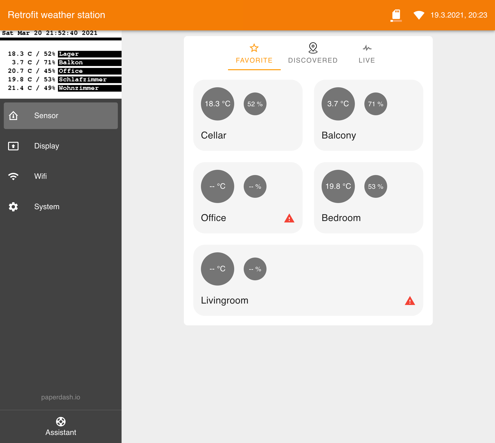

[]()
[](https://app.swaggerhub.com/apis/paperdash.io/weather-station-retrofit/0.1)
[]()
[]()


# 433 Mhz weater station

* 🌍 [Website](https://paperdash.io/) - Learn more about paperdash.io
* 📡 [Discover](http://local.paperdash.io/) - Find devices in your local network
* 👍 Like us on [Instagram](https://instagram.com/paperdash.io)




## Goals
* Bring 433 Mhz sensor modules into your network
* Convert an analog weather station to a digital one
* Customizable
* Work's `Out-of-the-box`
* Using standard parts to built

## Features

### Firmware
* Push 433 signals via WebSocket's
* Send sensor face to another paperdash display
* Wifi STA fallback if connection failed
* OTA update
* [REST API](https://app.swaggerhub.com/apis/paperdash.io/weather-station-retrofit/0.1)

### Web APP
* Push 433 signals via WebSocket's
* ESP-32 optimized vue.js Web APP
* [Material Design Framework](https://vuetifyjs.com/)
* First run setup wizard
* Basic PWA possibility


## API examples

```bash
# Get device stats as json
$ curl http://paperdash-epd.local/stats

# Download current image display
$ curl http://paperdash-epd.local/api/device/screen > current.bmp
```

# Getting started

## Necessary parts to build the project

* [Microcontroller ESP32](https://www.espressif.com/sites/default/files/documentation/esp32_datasheet_en.pdf)
* RXB6 433Mhz receiver

## ESP-32 firmware

> The whole architecture was inspired from the arduino concept with a setup() and loop() function.
> This is the reason why everything is broken down into separate modules below `/lib`. Each module has basically a `setupXXX()` and `loopXXX()` method.

### Build (with PlatformIO)
```bash
$ pio run --environment esp32

# update esp
$ platformio run --target upload
```

## Web APP

> Based on state of the art technologie [Vue.js](https://vuejs.org/) + [Vuetify](https://vuetifyjs.com/) + [Webpack](https://webpack.js.org/)

### Build
```bash
$ yarn --cwd app
$ yarn --cwd app build

# update esp
$ platformio run --target uploadfs

# alternative, create spiffs.bin
$ platformio run --target buildfs
```